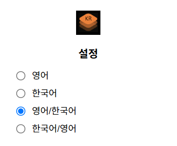
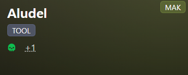
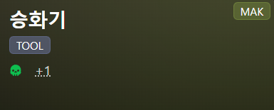
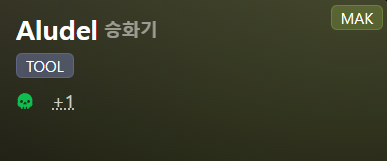
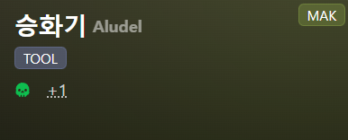

# BazaarDBKR

BazaarDB의 이름 한글화 크롬 확장 기능입니다.

확장 프로그램 다운 받기

>https://chromewebstore.google.com/detail/bazaardbkr/loacpjeegkdogkkjmnehnjnoenaemdhj

적용 대상 사이트

>https://bazaardb.gg/

## 설정

설정에서 표시 형식을 변경할 수 있습니다.

1. 영어

2. 한국어

3. 영어/한국어

4. 한국어/영어

## 업데이트 기록

v1.0(2025-10-22)

- 2025-10-22일자 번역 적용
- Items, Skills, Merchants, Trainers, Monsters, Events 이름에 적용
- 세부사항 이름에 적용

v1.1(2025-10-23)

- 세부사항 이름에 적용 안되는 현상 해결

v1.2(2025-10-23)

- 팝업 요소도 적용
- 코드 안정성 향상
